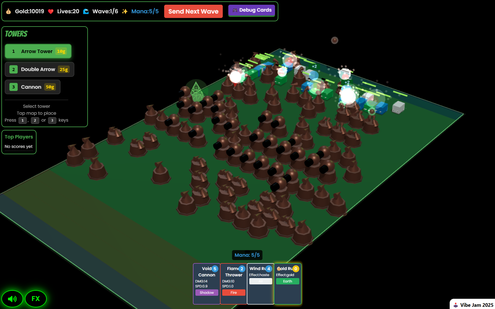
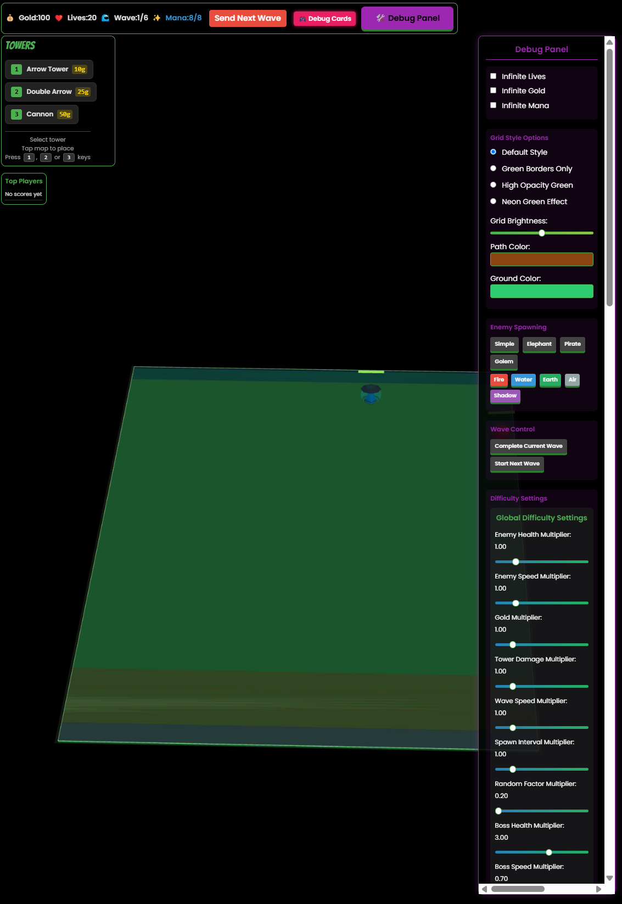

# GREEN TOWER DEFENSE 🤖 VIBE CODED 99% 🤖

## 🎮 Play Now

[Play the game online](https://greendefense.space)

## ✨ About

This tower defense game is 99% AI CODED using Claude Code (100% VIBE-CODED). What's vibe coding? It's when you use AI to build something without writing code yourself, just vibes and prompts. It feels like playing a game and that's how it should be!

- 🧠 **99% AI Generated**: Every line of code was written by Claude through prompts
- 🎮 **Gameplay**: Classic tower defense mechanics with a green theme
- 🔮 **Inspiration**: Old Warcraft 3 tower defense

## 🛠️ The Process

Inspired by [Vibe Jam 2025](https://jam.pieter.com/), I challenged myself to create a complete game without writing a single line of code myself. While I use AI coding assistants like Cursor for everyday work, this project pushed the boundaries for me. The result is a fully functional tower defense game where my role was purely as a creative director and prompt engineer.

The workflow was simple:
1. Test the game, note issues/desired features
2. Prompt Claude with fixes or new features (4-5 per prompt maximum)
3. Commit when reaching a stable state.
4. See in current commit if it's working as intended, tell exactly what to change if needed.
5. Repeat!
When something wasn't working, I'd discard changes and try different prompts rather than fixing code manually. This "no manual fixes" constraint was key to the experiment.

I truly feel like I didn't code anything myself. However, there were a few exceptions that make this 99% rather than 100% AI-coded:
- For background music and sound effects, I had to download assets myself after AI attempts produced poor results. I then instructed the AI to implement these downloaded sound effects.
- I made minimal CSS adjustments (perhaps 5 times maximum). Generally, I would inspect elements in DevTools and instruct the AI what to change, like: "change #controls to have a padding of 8px".
- DevOps deployment wasn't automated (could it be? Yes).

## 🔑 Key Insights

AI excels at creating helpers rather than just writing the final code. For example, instead of asking:
- "Make enemies more dynamic with better spawn timing and lower health"

I found it more effective to request:
- "Create a Debug Panel that allows me to adjust game variables like speed multipliers, health values, and spawn rates in real-time"

This approach proved incredibly powerful this time. By having AI build customization tools first, I could fine-tune the gameplay myself without needing to code or prompt for each specific change.

I apply this same principle in my professional work, when working with AI, I've found that asking it to build tools, configurators, factories, frameworks, control systems, etc from scratch leads to more coherent codebase understanding and maintainable results afterwards.

## 📝 First Prompt

My first prompt was simply:

> "I need to make a tower defense game, with a green theme, matrix futuristic style, using Three.js. Should look like Warcraft 3 old tower defense maps. To then have multiplayers in future. enemies go from top to bottom."

After asked Claude to enhance the prompt, I got this: [FIRST-PROMPT.md](./FIRST-PROMPT.md).

The first two version I just throw away, because I noticed that, besides the fact that I was able to learn from them, they were not maintanable or scalable. Sometimes on that versions when I wanted to change things, it was a pain.

## 🧪 Conclusion

This experiment demonstrates how far AI tools have come (for now 03/2025). The game is more of a prototype than a polished product, evolving it into commercial quality would require more $$$ and/or manual coding. I think humans will always be needed for refinement and creative direction, except that day when AI will be able to understand dopamine receptors without us telling what is fun.

How about Security, Code Quality, etc...? I'm sure there are many things to improve, dead code, etc... could be better in many ways, but I think we can agree that for a first scratched version, the game is fun!

## 📊 By The Numbers

- **Total tokens in**: 361,498,911
- **Total tokens out**: 1,979,572
- **Total cost**: $228.81
- **Development time**: 35-45 hours (I'm not sure about this, but I would say so)

### If project goes brrr, what I would like to do next:

1. Make game more detailed (textures, shaders, fx...)
2. Multiplayer would be awesome, having cards to send enemies hordes, etc.
3. Mix Teamfight Tatics, Tower Defense, and TCG elements.

### Deployed Successfully with [Coolify](https://coolify.io/)